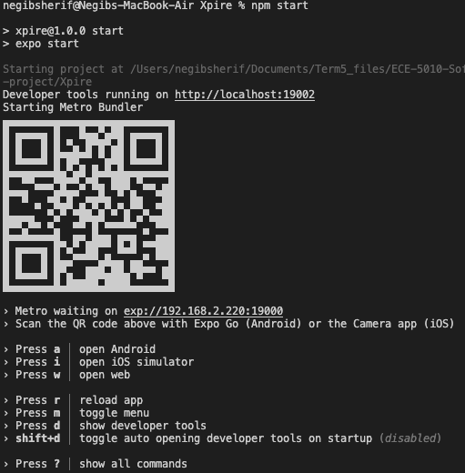
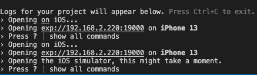

<p align="center">
  <a href="" rel="noopener">
 </a>
</p>

<h3 align="center">Xpire</h3>

<div align="center">

[]()
[](https://github.com/kylelobo/The-Documentation-Compendium/issues)
[](https://github.com/kylelobo/The-Documentation-Compendium/pulls)
[](/LICENSE)

</div>

---

## 🤔 Why Use it? 

It's about time we stop manually checking expiry dates of products and have an app for that. 😛

## 📝 Table of Contents

- [About](#about)
- [Getting Started](#getting_started)
- [Built Using](#built_using)
- [Authors](#authors)
- [Acknowledgments](#acknowledgement)

## 🧐 About <a name = "about"></a>

The Xprie app helps you keep track of the expiry dates of your food products so that you never have to look at a label again. Xpire is a cross platform app for iOS and Android. 

## 🏁 Getting Started <a name = "getting_started"></a>

These instructions will get you a copy of the project up and running on your local machine for development and testing purposes.

### Prerequisites

You will need Node.js, Xcode or Android Studio, and preferrably Visual Studio Code. 

### Installing

1. Clone this repo by typing the following command in a terminal window. 
```
git clone https://github.com/SanadAlwerfali/Xpire.git
``` 

2. Cd into the directory that you just cloned. 
```
cd Xpire
```
At this point, if you type 'ls', you should be able to see all the files in the repository listed. You should preferably do the next few steps in a terminal in VS code but it works if you continue to do it in your terminal as well. 

3. Run npm install to install all the dependencies. Note: This will not work if you do not have Node install already. Click here to install [Node](https://nodejs.org/en/download/) if you dont have it. 
```
npm install
```

Make sure that you have Xcode (Mac Users) and Android Studio (Mac and Windos Users) before going on to the next step. To download Xcode, go to the App store on your Mac and [Click here](https://developer.android.com/studio) to download Android Studio on your windows computer. 
4. Run npm install expo-cli to install the Expo CLI. 
```
npm install expo-cli
```

5. Lastly run npm start. This will build metro and allow you to spin up your emulator. You should see something like the following picture when you run this command. 



This should automatically open up expo builder in your browser. If not, then just click on the localhost link you see above the QR code in the above picture. 

6. In the terminal window, press i to open up an iOS emulator or press a to open up an Android emulator. You should see an ouput matching the following picture. 



Alternatively, instead of pressing i in step 6, you could go to the Metro Builder (local host) and click on run on iOS or Android emulator. 

7. That's it, you should be set up and you should see an iOS or Android emulator pop up with the project. 


## ⛏️ Built Using <a name = "built_using"></a>

- React Native
- Javascript
- Firebase

## ✍️ Authors <a name = "authors"></a>

- [Sanad Alwerfali](https://github.com/SanadAlwerfali) 
- [Negib Sherif](https://github.com/nssherif)

## 🎉 Acknowledgements <a name = "acknowledgement"></a>

- Hat tip to Sanad Alwerfali for project idea and brand name.